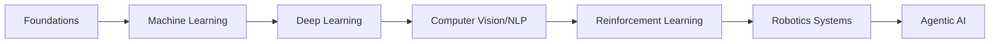

# AI/ML/Robotics Comprehensive Repository: From Fundamentals to SOTA Systems

[](LICENSE)

This repository decomposes AI/ML concepts and state-of-the-art systems into fundamental principles with mathematical derivations and NumPy implementations. Designed for researchers and engineers, it bridges theoretical foundations with modern implementations across:

- **Core ML**: Bayesian methods to ensemble learning
- **Deep Learning**: CNNs to Transformers
- **Robotics**: Sensor fusion to motion planning
- **Emergent Systems**: LLMs and agentic architectures

## Repository Structure

```shell
├── 0_Foundations/
│   ├── Linear_Algebra
│   ├── Probability_Theory
│   ├── Bayesian_Statistics
│   └── Optimization_Methods
│
├── 1_Machine_Learning/
│   ├── Supervised_Learning
│   │   ├── Regression
│   │   └── Classification
│   ├── Unsupervised_Learning
│   │   ├── Clustering
│   │   └── Dimensionality_Reduction
│   └── Ensemble_Methods
│
├── 2_Deep_Learning/
│   ├── Neural_Networks
│   ├── CNN_Architectures
│   ├── RNN_Variants
│   └── Attention_Mechanisms
│
├── 3_Computer_Vision/
│   ├── Image_Classification
│   ├── Object_Detection
│   ├── Semantic_Segmentation
│   └── 3D_Vision
│
├── 4_NLP_LLMs/
│   ├── Embeddings
│   ├── Seq2Seq_Models
│   ├── Transformer_Architecture
│   └── Prompt_Engineering
│
├── 5_Reinforcement_Learning/
│   ├── MDPs
│   ├── Value_Based_Methods
│   ├── Policy_Based_Methods
│   └── Multi_Agent_RL
│
├── 6_Robotics/
│   ├── Sensor_Fusion
│   │   ├── Kalman_Filters
│   │   └── Particle_Filters
│   ├── SLAM
│   └── Motion_Planning
│
├── 7_Agentic_Systems/
│   ├── Agent_Architectures
│   ├── Memory_Models
│   └── Tool_Use_Reasoning
│
├── SOTA_Model_Breakdowns/
│   ├── Vision/
│   │   ├── ViT
│   │   ├── YOLOv10
│   │   └── SAM
│   ├── NLP/
│   │   ├── Llama3
│   │   ├── Mixtral
│   │   └── RAG_Systems
│   ├── Multimodal/
│   │   ├── CLIP
│   │   └── GPT-4o
│   └── Robotics/
│       ├── RT-X
│       └── Tesla_Optimus_System
│
├── datasets/
└── utils/
```

## Key Features

1. **Concept-First Approach**

   - Each concept starts with mathematical formulation
   - Visualized operations (e.g. convolution backpropagation)
   - NumPy implementations under `*/Core_Modules/`

2. **SOTA Deconstruction**

   - Model dissection in `SOTA_Model_Breakdowns/`
   - Paper explanations with module-level math
   - Build-from-scratch implementations

3. **Robotics Integration**
   - Sensor fusion implementations (Kalman filters → particle filters)
   - Real-world perception-action loops

## Learning Path



## Contribution Guide

- Submit PRs for new SOTA model breakdowns
- Include: Paper summary → Module decomposition → NumPy implementation
- Maintain consistent folder structure

## Resources

-
-

> "What I cannot create, I do not understand." - Richard Feynman

<!-- ### Key Improvements: -->
<!-- 1. **Progressive Learning** - Ordered from fundamentals to advanced systems -->
<!-- 2. **SOTA Integration** - Dedicated folder with standardized breakdown format -->
<!-- 3. **Robotics Focus** - Sensor fusion and real-world constraints emphasized -->
<!-- 4. **Implementation Standards**: -->
<!--    - Each module has: math explanation → standalone NumPy code → integration -->
<!--    - Model rebuilds include computational graph visualizations -->
<!-- 5. **Research-Practice Bridge** - Paper links with executable implementations -->
<!-- 6. **Extras**: -->
<!--    - MermaidJS learning path diagram -->
<!--    - Implementation badges (e.g. "NumPy-only") -->
<!--    - Contribution guidelines for model additions -->
<!---->
<!-- This structure supports both bottom-up learning and top-down SOTA exploration while maintaining implementation rigor across domains. -->
